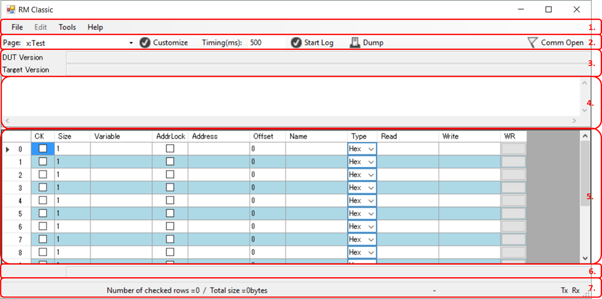

# How To Use RM Classic

## 1 Application Window Description
When you start the RM Classic application, the main window is displayed on the screen.
The initial look of the main window is shown in Figure 1-1. The application window consists of seven panes.

*Figure 1-1.RM Classic Initial screen*

### 1.1 Menu Bar

- #### 1.1.1 File Menu
    - *Open->View File:* opens a View-file(*.xml).
The view-file is shown in the Variable Watch Grid.
The application caption displays the view-file name.
The file name of view-file needs to contain two identifiers(_StV, _TgV).
For example: 
The file name: aaa_StVbbb_TgVccc
The application caption: aaa(bbb)
Target version in the version information: ccc
    - *Open->Map File* opens the new map file.
Address values and size values will be updated in the Variable Watch Grid.
If variable's name is not found, an address value will be cleared and the CK column will be also unchecked.
After succeed opening a map file, Word complation is enable in the variable column and
 the application automatically input address and size in each columns when names of variables found in a map file. 
    - *Save->View File* saves the cuurent view-setting into the new view-file.
After saving a view-file as another view-file name, the caption title will be updated.
    - *Save->Map File* saves the map file into the RM Clssic format.
    - *Exit* exits the application.

- #### 1.1.2 Tools Menu
    - *Options* opens the dialog box for communication settings.
This dialog box allows you to set up the parameters related to comunication with your target board.

- #### 1.1.3 Help Menu
    - *About* shows about RM Classic.

### 1.2 Tool Bar

- #### 1.2.1 Page ComboBox
    - *Page ComboBox* shows how many pages in View-file.
The Variable Watch Grid will be changed when you select another pages.

- #### 1.2.2 Customize Button
    - *Customize Button* switches from comunication mode to customize mode.
You can edit all cells(without the read value column) in the Variable Watch Grid.
Context menu is also enabled. you can delete, insert and copy a row or a page.

- #### 1.2.3 Timing TextBox
    - *Timing TextBox* shows a transmission interval.
You can change value of transmission interval while comunicating with your target.

- #### 1.2.4 Logging Button
    - *Logging Button* is enable to store data.
The result copied to clipboard when the button click once again.

- #### 1.2.5 Dump Data Button
    - *Dump Data Button* opens the dump-data dialog box for receiving large bulk data.

- #### 1.2.6 Communication Button
    - *Communication Button* is a switch to enter or leave the communication mode.
*Communication Button* starts or stops the communication with your target board.
The button, which displayed as "Comm Close" with the red flag, indicates under communicating with the board.
The button, which displayed as "Comm Open" with the gray flag, indicates disable to communicate with the board and unlocks the communication port.
The read value columns automatically update while the application communicate with the board.

### 1.3 Version Information
- *DUT Version* displays version name which sent from the target board.

- *Target Version* displays version name which defined name of the view-file.

### 1.4 Communication Log
This area displays payload data while communicating.

### 1.5 Variable Watch Grid
This area has data table which contains several group(columns).

- #### 1.5.1 Check Column
    Checked row data will be recieved from your target baord.
- #### 1.5.2 Size Column
    Specify the size of the variable as it is defined in target application.
- #### 1.5.3 Variable Column
    Specify the variable name as the variable identifier in target application.
- #### 1.5.4 Address lock Column
    The application doesn't reload the address automatically when this colum is checked.
- #### 1.5.5 Address Column
- #### 1.5.6 Offset Column
    The address column shows physical address of the variable in the target application memory. 
The offset Column indicates distance from the address.

- #### 1.5.7 Name Column
    Explanation about the row or variable.

- #### 1.5.8 Type Column
    Select the variable type as it is defined in the target application.
Select the proper format from the drop-down list (ex HEX;Hexadecimal, UsD;Unsigned-decimal, DEC;Signed-decimal, BIN;Binary, FLT;Floating point IEEE).

- #### 1.5.9 Read value Column
    Read value received from your target application.
This column periodically update while communicating. 
Read Value is decoded according to size and type of display selected.

- #### 1.5.10 Write value Column
    Write value column same as the read value column.
You can type value which you want to overwrite for a variable or specified address.
The write-value should be appropriate value based on the size column and the type column.

- #### 1.5.11 Write trigger Column
    Click on this column, the application write the write value column's value to the target application memory.

### 1.6 Warning information
This area displays warning information.

### 1.7 Status Bar
This area displays several information about communication.

- #### 1.7.1 Total size estimation
    This area displays how many rows you checked and total size from checked rows.

- #### 1.7.2 Transmission time estimation
    Maximum and munimum transmission time based on the total size.

- #### 1.7.3 Tx/RX indicater
    Flashing Tx indicates the application could send data.
    Flashing Rx indicates the application could receive data.

