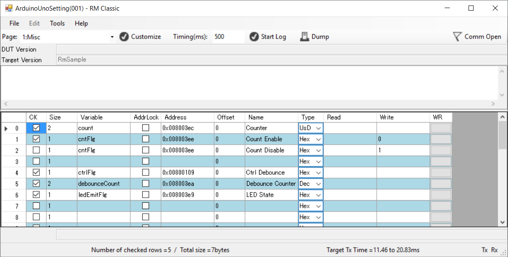
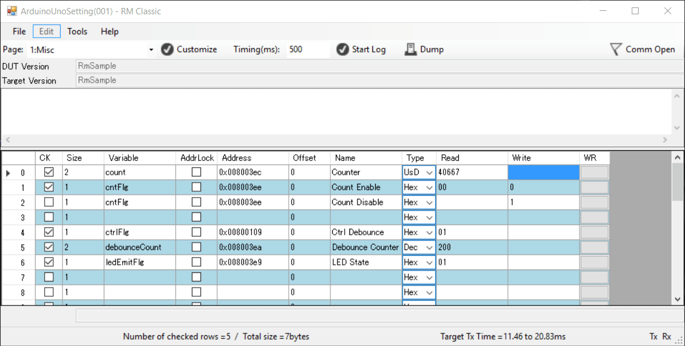
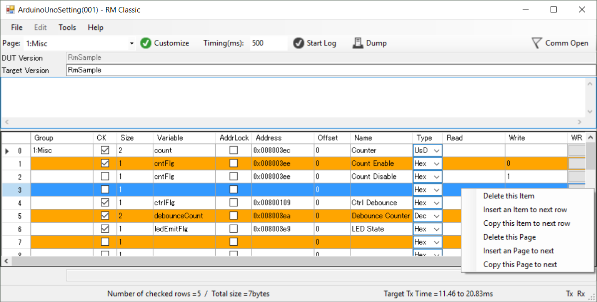

# RM Classic

RM Classic is a real-time debugging monitor for embedded software.

This tool provides monitoring variables via serial communication interface to your target. You can read and write internal variables in embedded CPU.

RM Classic needs the embedded software driver, which is called [RM-Comm](https://github.com/NaoNaoMe/RM-Comm), on your target.


# How to use RM Classic
This tutorial describes the introduction of RM Classic. The following procedures are how to use RM Classic with your Arduino. 
You could find a demonstartion on my [youtube channel](https://youtu.be/uLL1HGZ19iA).


## Table of Contents
- 1 Quick Start
 - [1.1 Download latest release](#11-build-rm-classic)
 - [1.2 Upload an example sketch](#12-upload-an-example-sketch)
 - [1.3 Configure RM Classic options](#13-configure-rm-classic-options)
 - [1.4 Communicate to Arduino](#14-communicate-to-arduino)
- 2 Configuration
 - [2.1 Enable to change Variables](#21-enable-to-change-variables)
 - [2.2 Preparing to make a map file](#22-preparing-to-make-a-map-file)
 - [2.3 Import map file to RM Classic](#23-import-map-file-to-rm-classic)
 - [2.4 Configure variables and other items](#24-configure-variables-and-other-items)

## 1.1 Launch RM Classic
First of all, you need to download latest RM Classic.
Download windows exe file from release page, the following window appears when you start RM Classic.


## 1.2 Upload an example sketch
Please refer to [RM Comm](https://github.com/NaoNaoMe/RM-Comm) repository page.
Please add RM Comm library to Arduino IDE and upload an example sketch.

## 1.3 Configure RM Classic options
RM Classic needs a configuration file which is called View Setting file.
RM Comm library has example View Setting files. You can find out in Arduino libraries directory, '\\Arduino\\libraries\\RM-Comm-master\\ViewSetting Sample'.
To import View Setting file, navigate to: File > Open > View file.
When you use Arduino Uno (ATmega328P), open 'ArduinoUnoSetting_StV001_TgVRmSample.xml'.
When you use Arduino Zero (SAMD21G), open 'ArduinoUnoSetting_StV001_TgVRmSample.xml'.

RM Classic is displayed as follows, when importing is success.



You must specify the configuration of your serial port before you communicate to your target. UART properties of example sketch are following values.
+ Baud rate: 9600bps
+ Data bits: 8 bits (fixed on RM Classic)
+ Parity: none (fixed on RM Classic)

'Comm Port' should appropriately select for your target.

Next, you must specify the configuration of address wides.
When you use Arduino Uno (ATmega328P), select 'Address:2byte'.
When you use Arduino Zero (SAMD21G), select 'Address:4byte'.

To configure these settings, navigate to: Tools > Options.  


## 1.4 Communicate to Arduino
Finally, when you click 'Comm Close' icon, the icon turns to 'Comm Open', and RM Classic communicates with your target.
You can see Counter value in which first row is increasing.



"WR" column is button as changing value command.
If you click a button in "Count Disable" row, the counter value will be stopped soon.


## 2.1 Enable to change Variables
If you might want to read another variables, you need to create a map file.
Generally, map file contains variable name, size and address in SRAM of CPU.
RM Classic refers address and size, and access specified variables.

In order to make a map file, you need to create an elf file.
Arduino IDE generates elf file and various object files in temporary folders, but this folder changes with every build.
And also elf file isn't easy to read.  
So, you should relocate folder place to easily find elf file and 'avr-readelf' command output information about elf file.

These below site are very helpful to changing preference.  
[Arduino Preferences](https://www.arduino.cc/en/Hacking/Preferences)  
[Where to find Arduino Hex files or Output Binaries](https://www.kanda.com/blog/microcontrollers/avr-microcontrollers/find-arduino-hex-files-output-binaries)  
But before warned changing folder, Arduino IDE remove all files and folders at specified path.

## 2.2 Preparing to make a map file
Folder structure is following hierarchy in this introduction.
* D:\WorkSpace\Arduino
    + \tmp
    + \map

Open a preference text of Arduino IDE and add below text.
```
build.path=D:\WorkSpace\Arduino\tmp
```

Make a batch file in 'map folder', the batch file contents is following text if you use Arduino UNO.
```
for /f "delims=" %%a in ('where /r ..\tmp\ *.elf') do @set RESULT=%%a

path=%PROGRAMFILES%\Arduino\hardware\tools\avr\bin

avr-readelf -a %RESULT% | avr-c++filt > test.map

```
If you use windows 64bit edition, path name should be following text.
```
path=%PROGRAMFILES(X86)%\Arduino\hardware\tools\avr\bin

```

If you use Arduino Zero, the batch file contents is following text.
```
for /f "delims=" %%a in ('where /r ..\tmp\ *.elf') do @set RESULT=%%a

path=%USERPROFILE%\AppData\Local\Arduino15\packages\arduino\tools\arm-none-eabi-gcc\4.8.3-2014q1\bin

arm-none-eabi-readelf -a %RESULT% | arm-none-eabi-c++filt > test.map

```

After you build your sketch on Arduino IDE, you execute the batch file, and you can find 'test.map' in 'D:\WorkSpace\Arduino\tmp'.

## 2.3 Import map file to RM Classic
Import generated map file, navigate to: File > Open > Map file.
After importing a map file, RM Classic is enable auto-complete function in 'variable column'.

## 2.4 Configure variables and other items
You can type size, varialble namea, address, offset and name long as unchecked in CK column.
Something wrong values in Variable Watch Grid, warning icon is shown in each cells.
When you click in CK column, the row's variable immediately enable to read.

When you add new variables in Variable Watch Grid, you type variable name in variable column.
unchecked row

When you want to configure page name, add pages or remove page, click Customize button in tool bar.
RM Classic is under Customize state, appearance is like following.
It is also enable context menu in datagrdiview and you can configure each pages.



Click Customize button again, RM Classic goes back and can communicate to the target.

