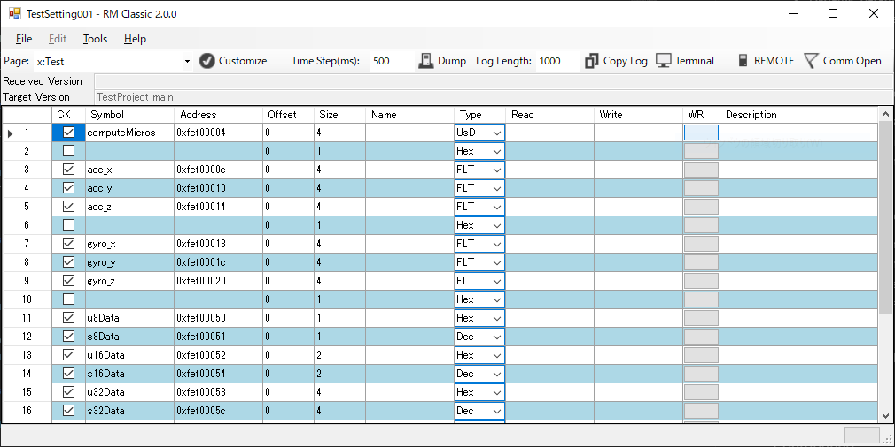

# RM Classic: Enhanced Real-Time Data Monitoring for Embedded Systems

**RM Classic** is a real-time data monitoring tool that aids the debugging process of live variables in embedded software. This tool is designed to streamline the analysis and diagnosis of embedded systems by providing live insights without halting the execution of programs.

## Introduction to Live Variable Debugging

Live variable debugging is crucial in embedded system development. It allows developers to observe and diagnose the real-time behavior of variables within a running program, ensuring continuous monitoring for any unexpected system behaviors.

## Communication with Microcontrollers

**RM Classic** uses UART for communication with microcontrollers, offering a straightforward, cost-effective solution for real-time debugging without the need for JTAG or similar proprietary technologies. Integration of RM Classic's communication code into the microcontroller is essential. Despite not matching the data throughput of specialized devices, RM Classic is versatile and vendor-independent, suitable for various microcontrollers.

For a practical example of integrating RM Classic with a microcontroller, check out the [rm_embedded](https://github.com/NaoNaoMe/rm_embedded) repository. It demonstrates how to enable connectivity between RM Classic and microcontrollers, specifically showcasing the process using an Arduino. This repository serves as a guide for those looking to implement RM Classic in embedded systems projects.

## Advantages of RM Classic

RM Classic offers a suite of features that enhance the debugging workflow:

- **Uninterrupted Monitoring**: It enables real-time observation of variable changes, maintaining system operation without the need for breakpoints.
- **Remote Operation**: Control systems remotely via TCP/IP for tasks such as modifying variables and managing data logs, much like remote systems in measurement and instrumentation.
- **Non-Invasive Debugging**: Monitor and log data without disrupting the system's normal functioning.

## Core Functionality

### Real-Time Variable Monitoring and Data Injection

- **Variable Monitoring**: Monitors statically allocated variables with known addresses and sizes, displaying values based on type information.
- **Data Injection**: Allows for real-time value overwriting, facilitating dynamic system parameter adjustments and monitoring behavioral changes.

### Data Logging and Retrieval

- **Continuous Data Logging**: Data observation is continuously recorded. Since issues can arise unexpectedly, the 'Copy log' button is a handy tool for capturing potentially valuable data in such events.
- **Data Dump**: The 'Dump' feature permits retrieval of data from specific addresses and sizes, complementing the debugging tools.

### Pseudo-Serial Communication Capability

- **Terminal Interface**: It comes equipped with a serial communication terminal interface, modeled after the Arduino serial monitor. While it doesn't constitute genuine serial communication since it operates through the RM communication interface, it enables asynchronous sending and receiving of data. This function can be particularly useful for displaying text when specific points in a program are reached, akin to printf-style debugging.

### Automation and Remote Control

- **TCP Server**: RM Classic features a TCP server mode that allows for remote operations.
- **Automation**: Automation is also feasible using programming languages like Python and MATLAB, greatly easing complex tasks like experimenting with multiple parameters in real systems and data collection.

### User Interface

- **Classical Interface**: The hallmark of RM Classic lies in its classic user interface. While the Winforms-based interface might be outdated, but it ensures clarity and avoids confusion.

## Additional Considerations

- **Data Visualization**: While RM Classic focuses on simplicity and lacks built-in data visualization, its remote operation functionality enables the development of custom visualization interfaces using various languages and frameworks.

## Contributing

Contributions are welcome! If you find a bug or have a feature request, please open an issue on GitHub.

## License

This project is licensed under the MIT License. See the `LICENSE` file for more information.
