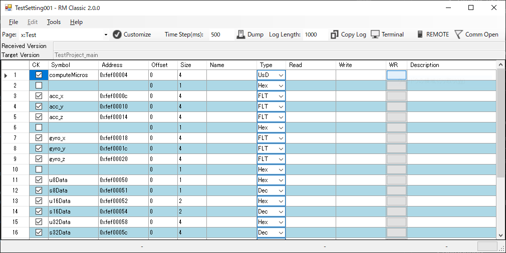

# RM Classic: Real-Time Variable Monitoring for Embedded Systems

**RM Classic** is a real-time data monitoring tool for embedded systems development. It lets you observe and modify live variables in a running MCU over UART — all you need is a serial connection, no JTAG adapter or debug probe required.

## Requirements

- Windows 10 or later
- No installation — download the single `.exe` from [Releases](https://github.com/NaoNaoMe/RM-Classic/releases)

## Features

### Real-Time Variable Monitoring

Observe statically allocated variables by address and type. Values update continuously without halting the MCU or requiring breakpoints.

### Data Injection

Write new values to variables at runtime to test parameter changes or directly override system behavior.

### Remote Operation

RM Classic exposes a TCP server interface that allows external programs to read and write variables programmatically.

- **Automated test sequences** — drive parameter changes and read results from Python or MATLAB with precise, repeatable timing.
- **Instrument integration** — synchronize with external measurement devices to automate data collection and inspection workflows.

### Data Logging

All observed values are recorded continuously in the background. Use **Copy Log** to capture a snapshot at any moment; use **Dump** to read a raw block of MCU memory by address and size.

### Terminal

A built-in terminal — similar to the Arduino IDE Serial Monitor — lets you send and receive plain text over the same UART connection alongside the monitoring protocol, useful for printf-style debug output from firmware.

## Quick Start

The following example uses an Arduino Uno with the [rm_embedded](https://github.com/NaoNaoMe/rm_embedded) sample sketch.

1. **Flash the MCU** — upload `RmSample/RmSample.ino` to your Arduino Uno.
2. **Connect** the Arduino to your PC.
3. **Download RM Classic** from [Releases](https://github.com/NaoNaoMe/RM-Classic/releases) and run the `.exe`.
4. **Load the configuration** — go to **File > Open > View File** and open `RMConfiguration--RmSample.rmxml` (included in the rm_embedded repository).
5. **Configure the connection** — set baud rate to **9600 bps**, password to **`0x0000FFFF`**, and address width to **2 bytes**.
6. **Connect** — click **Comm Open**. The version string `RmSample` confirms a successful connection.

Variables such as `count` and `isCounting` are now visible and editable in real time.

## Protocol

The wire format between RM Classic and MCU firmware is documented in [RM\_Protocol\_Specification.md](RM_Protocol_Specification.md).

## MCU Integration

Firmware library and integration examples for connecting MCUs to RM Classic are available in the [rm_embedded](https://github.com/NaoNaoMe/rm_embedded) repository.

## License

This project is licensed under the MIT License. See the [LICENSE](LICENSE) file for details.