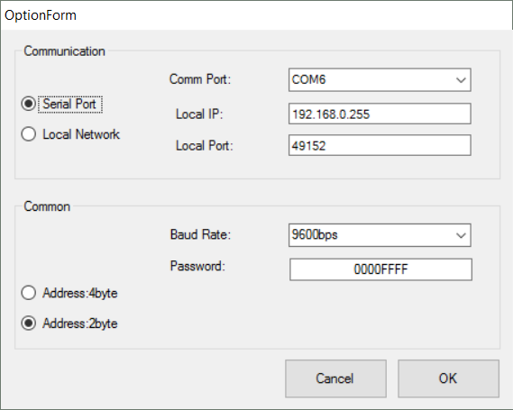

# RM Classic
RM Classic is a debug monitor tool for Arduino, mbed and so on.  
This tool provides monitoring variables via serial communication interface to your target. You can read and write internal variables in embedded CPU.
RM Classic can only run on windows, but [Cross-platform edition](https://github.com/NaoNaoMe/RM-Classic-Cross-Platform) is available.


RM Classic needs the embedded software driver, which is called [RM-Comm](https://github.com/NaoNaoMe/RM-Comm), on your target.

## License
MIT


# How to use RM Classic
This tutorial describes the introduction of RM Classic. The following procedures are how to use RM Classic with your Arduino. 
You could find a demonstartion on my [youtube channel](https://youtu.be/uLL1HGZ19iA).


## Table of Contents
- 1 Quick Start
 - [1.1 Build RM Classic](#11-build-rm-classic)
 - [1.2 Upload an example sketch](#12-upload-an-example-sketch)
 - [1.3 Configure RM Classic options](#13-configure-rm-classic-options)
 - [1.4 Communicate to Arduino](#14-communicate-to-arduino)
- 2 Configuration
 - [2.1 Enable to change Variables](#21-enable-to-change-variables)
 - [2.2 Preparing to make a map file](#22-preparing-to-make-a-map-file)
 - [2.3 Import map file to RM Classic](#23-import-map-file-to-rm-classic)
 - [2.4 Configure variables and other items](#24-configure-variables-and-other-items)
- 3 Another feature
 - [3.1 Logging and receive dump data](#32-logging-and-receive-dump-data)
 - [3.2 Communication through WiFi](#32-communication-through-wifi)

## 1.1 Build RM Classic
First of all, you need build RM Classic.
RM Classic is built on Visual Studio, so please download and install latest Visual Studio Express edition.
Download zip file from RM Classic Repository, you can find out the solution file(\*.sln) in unzip folder, open solution file and build it.
The following window appears when you build succeeds.


## 1.2 Upload an example sketch
Please refer to [RM Comm](https://github.com/NaoNaoMe/RM-Comm) repository page.

## 1.3 Configure RM Classic options
After add RM Comm library in Arduino IDE, you need to configure RM Classic setting.
RM Classic needs a configuration file which is called View Setting file.
RM Comm library has an example View Setting file which named 'ArduinoUnoSetting_StV001_TgVRmSample.xml'.
You can find out in Arduino libraries directory, '\\Arduino\\libraries\\RM-Comm-master\\ViewSetting Sample'.
To import View Setting file, navigate to: File > Open > View file.


RM Classic is displayed as follows, when importing is success.


You must specify the configuration of your serial port before you communicate to your target. UART properties of sample sketch are following values.
+ Baud rate: 9600bps
+ Data bits: 8 bits (fixed on RM Classic)
+ Parity: none (fixed on RM Classic)

Comm Port should appropriately select for your target.

Next, you must specify the configuration of address wides.
Arduino Uno based on the ATmega328P, so you need to select 'Address:2byte'.

To configure these settings, navigate to: Tools > Options.  


## 1.4 Communicate to Arduino
Finally, when you click 'Comm Close' icon, the icon turns to 'Comm Open', and RM Classic communicates with your target.
You can see Counter value in which first row is increasing.


"WR" column is button as changing value command.
If you click a button in "Count Disable" row, the counter value will be stopped soon.


## 2.1 Enable to change Variables
If you might want to read another variables, you need a map file.
Generally, map file contains variable name, size and address in SRAM of CPU.
RM Classic refers address and size, and access specified variables.

In order to make a map file, you need elf file.
Arduino IDE generates elf file and various object files in temporary folders, but this folder changes with every build.
And also Elf file isn't easy to read.  
So, you should relocate folder place to easily find elf file and 'avr-readelf' command output information about elf file.

These below site are very helpful to changing preference.  
[Arduino Preferences](https://www.arduino.cc/en/Hacking/Preferences)  
[Where to find Arduino Hex files or Output Binaries](https://www.kanda.com/blog/microcontrollers/avr-microcontrollers/find-arduino-hex-files-output-binaries)  
But before warned changing folder, Arduino IDE remove all files and folders at specified path.

## 2.2 Preparing to make a map file
First of all, folder structure is following hierarchy in this introduction.
* D:\WorkSpace\Arduino
    + \tmp
    + \map

Open a preference text of Arduino IDE and add below text.
```
build.path=D:\WorkSpace\Arduino\tmp
```

Make a batch file in map folder, the batch file contents is following text.
```
for /f "delims=" %%a in ('where /r ..\tmp\ *.elf') do @set RESULT=%%a

path=C:\Program Files\Arduino\hardware\tools\avr\bin

avr-readelf -a %RESULT% | avr-c++filt > test.map

```
After you build your sketch on Arduino IDE, you execute the batch file, and you can find 'test.map' in 'D:\WorkSpace\Arduino\tmp'.

## 2.3 Import map file to RM Classic
Import generated map file, navigate to: File > Open > Map file.
After importing a map file, RM Classic is enable auto-complete function in 'variable column'.


## 2.4 Configure variables and other items
Click to: Tools > Customize > Setting View. RM Classic allow configuration of variables and other cells.


RM Classic is under setting state, appearance is like following.
RM Classic shows address and size in a map file when you modified value in 'variable column'.


Click Setting View again, RM Classic goes back and can communicate to the target.

## 3.1 Logging and receive dump data
RM Classic supports logging and dump mode.
These results of functions copy to 'clip board'.

## 3.2 Communication through WiFi
RM Classic supports network socket(as TCP client).
You could try to communicate with your target through local network if you have UART-WiFi bridge that supports transparent mode.

If you have the esp8266 board, [ESP8266-WiFi-UART-transparent-bridge](https://github.com/NaoNaoMe/ESP8266-WiFi-UART-transparent-bridge) is useful.
You could find a tutorial on my [youtube channel](https://youtu.be/QDO9URz7r5U).

