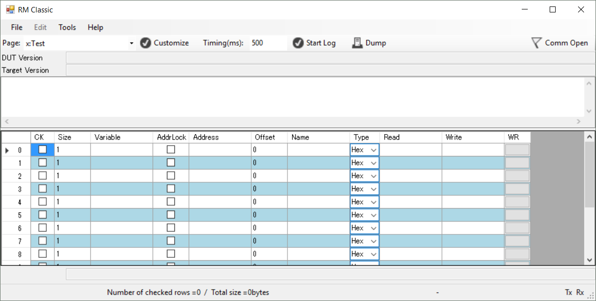

# RM Classic
RM Classic is a real-time debugging monitor for embedded software.

This tool allows you to monitor variables on an on-board CPU in real time with using serial communication or tcp/ip communication.

Generally speaking, We use on-chip debugger when we test embedded software.
Debugger allows us to stop or step execution. We can check or alter variables and register contents when debugger makes software stop execution.
However, Embedded software run in real-time, so it might be dangerous that real-time system was stopped. For example, system still output PWM at 100% duty cycle.
This tool allows you to collect variables periodically without stop and change a content of variable.

This tool needs communication library, which is called [RM-Comm](https://github.com/NaoNaoMe/RM-Comm), on your target.

# Table of contents
- 1 How To Use
- 2 Setting File
- 3 Logging Data
- 4 Dump Data
- 5 Over The Air

## Features and bugs
If you find a bug or desire some feature, please create an issue here in Github.

## License
MIT

