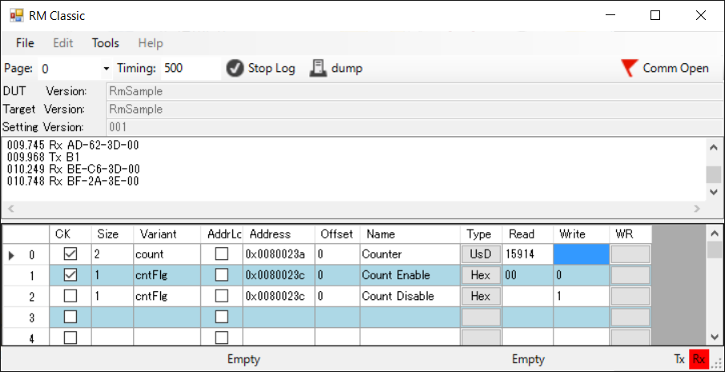
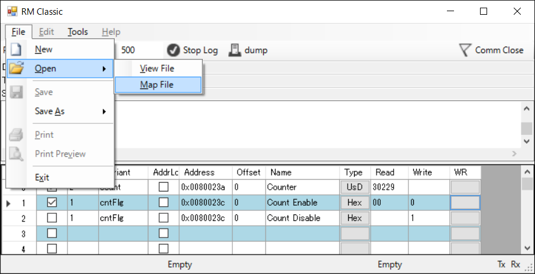
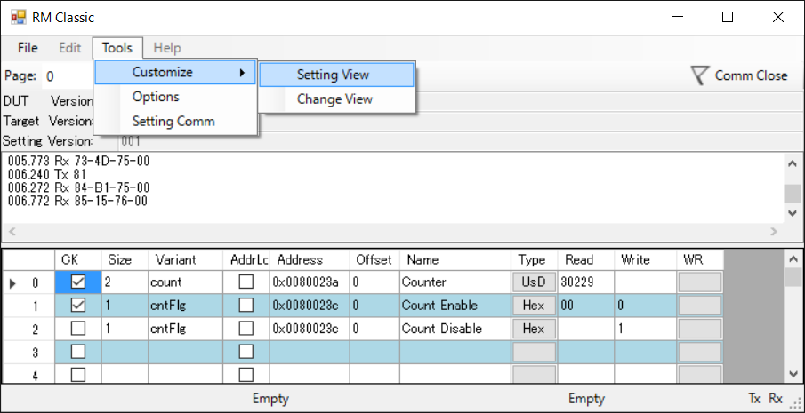
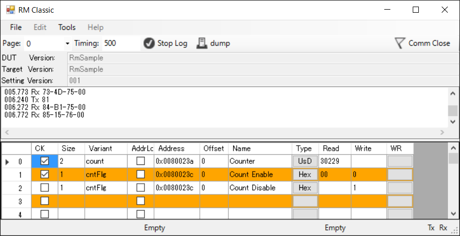

# How to use RM Classic
## Build RM Classic
Click "Download ZIP" in RM Classic repositry page.  
Firtst of all, you need build RM Classic.
RM Classic is built on Visual Studio, so please download and install latest VisualStudio express edtion.

Download zip file form RM Classic Repositry and extract zip file.  
You can find out the solutionfile(\*.sln), open solution file and buitd it.


## Upload example sketch
Next, Preparing embedded side.  
Click "Download ZIP" in [RM-Comm](https://github.com/NaoNaoMe/RM-Comm) repositry page.  
Open the Arduino IDE and navigate to: Sketch > Include Library > Add .ZIP Libraries and import downloaded zip file.

This library contains an example which navigate to: File > Examples > RmComm > RmSample. This example needs MsTimer2 library.  
After RmSample is uploaded to your Arduino board, Arduino is ready to communicate with RM Classic.


## Configure RM Classic options
After uploaded example sketch, you configure RM Classic setting.  
RM Classic need a configration file which is called View Setting file.
This library also implement a ViewSetting example.  
You can find out in Arduino libraries directory, "\\Arduino\\libraries\\RM-Comm-master\\ViewSetting Sample\\ViewSetting_TgVRmSample_StV001.xml"  
To import View Setting file, navigate to: File > Open > View file.  
If importing is succses, RM Classic is displayed as follows


Option and communication configration will be set like below.  
To configure these setting, navigate to: File > Tools > Options and Setting Comm.  
Comm Port should appropriately select for your Ardunino Board.


## Communication is ready
Finally, you'll click "Comm Close" Icon, RM Classic will communicate to your target. You can see Counter value is increment, and "WR Column" is button as changing value command. If you click wr button of "Count Disable" row, Counter will be stopped.



## Enable to change Variables
If you might want to read another variants, you need a Map file.
Generally, map file contains variant name, variant size and address in SRAM of CPU. RM Classic refer variant address and variant size and access specified variants.

In order to make a map file, you need elf file. Arduino IDE generates elf file and varius object files in temporary folders, but this folder changes with every build. And also Elf file isn't easy to read.  
So, you should relocate folder place to easily find elf file and "avr-readelf" command output information about elf file.

These below sight are very helpfull to changing preference.  
[Arduino Preferences](https://www.arduino.cc/en/Hacking/Preferences)  
[Where to find Arduino Hex files or Output Binaries](https://www.kanda.com/blog/microcontrollers/avr-microcontrollers/find-arduino-hex-files-output-binaries)  
But before warned changing folder, Arduino IDE remove all files and folders at specified path.

## Preparing to make a map file
The indtroduction folder structure should look like this:
* D:\WorkSpace\Arduino
    + \tmp
    + \map

Open a preferece text of Arduino IDE and add below sentence
```
build.path=D:\WorkSpace\Arduino\tmp
```

Make a batch file in map folder, the batch file contents is below.
```
for /f "delims=" %%a in ('where /r ..\tmp\ *.elf') do @set RESULT=%%a

path=C:\Program Files\Arduino\hardware\tools\avr\bin

avr-readelf -a %RESULT% > test.map

```
After you build your sketch on Arduino IDE, you execute the batch file, and you can find a map file in "D:\WorkSpace\Arduino\tmp".

## Import map file to RM Classic
Navigate to: File > Open > Map file. Import generated the map file.



## Configure variables and other items
Navigate to: Tools > Customize > Setting View. RM Classic allow configuration of Variables and other items.



RM Classic is under setting state, appearance is like below.



Click Setting View again, RM Classic goes back and can communicate to the target.
