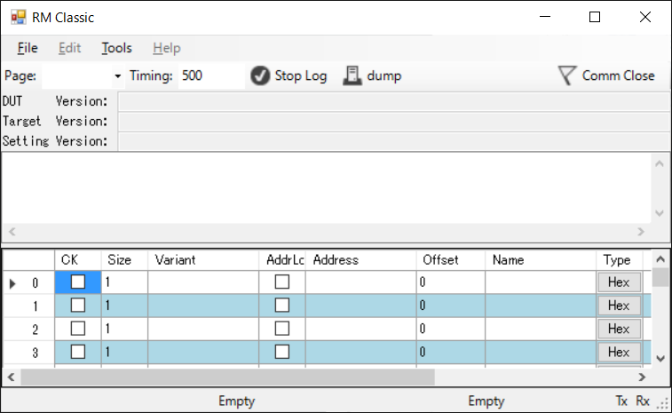
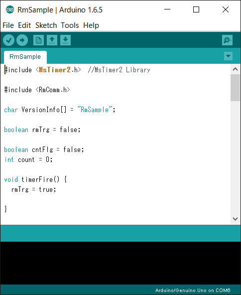
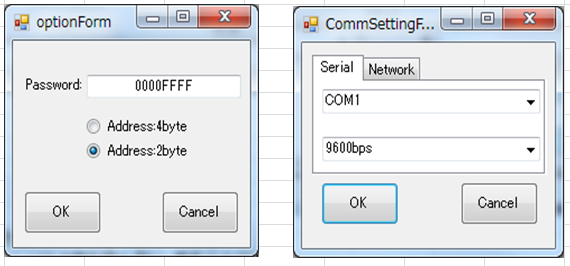

# How to use RM Classic
Click "Download ZIP" in RM Classic repositry page.  
Firtst of all, you need build RM Classic.
RM Classic is built on Visual Studio, so please download and install latest VisualStudio express edtion.

Download zip file form RM Classic Repositry and extract zip file.  
You can find out the solutionfile(\*.sln), open solution file and buitd it.

Next, Preparing embedded side.  
Click "Download ZIP" in [RM-Comm](https://github.com/NaoNaoMe/RM-Comm) repositry page.  
Open the Arduino IDE and navigate to: Sketch > Include Library > Add .ZIP Libraries and import downloaded zip file.

This library implements an example which navigate to: File > Examples > RmComm > RmSample. This example needs MsTimer2 library.  
After RmSample is uploaded to your Arduino board, Arduino is ready to communicate with RM Classic.

After uploaded your sketch, you configure RM Classic setting.  
RM Classic need a configration file which is called View Setting file.
This library also implement a ViewSetting example.  
You can find out in Arduino libraries directory, "\\Arduino\\libraries\\RM-Comm-master\\ViewSetting Sample\\ViewSetting_TgVRmSample_StV001.xml"  
To import View Setting file, navigate to: File > Open > View file.  
If importing is succses, RM Classic is displayed as follows

Option and communication configration will be set like below.  
To configure these setting, navigate to: File > Tools > Options and Setting Comm.  
Comm Port should appropriately select for your Ardunino Board.

Finally, you'll click Comm Close Icon, RM Classic will communicate to your target.
